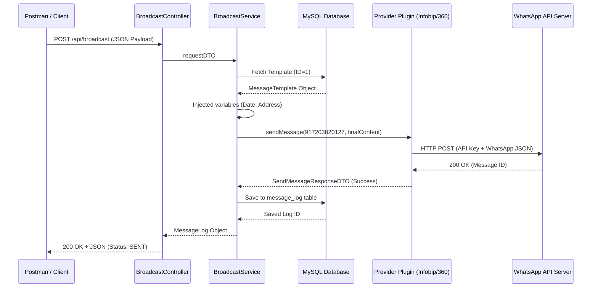

# Professional Message Broadcasting System: Technical Deep Dive & Execution Trace

This document provides a comprehensive, line-by-line technical analysis of the message broadcasting flow. It explains the "Chain of Responsibility" from the initial REST API request to the final database persist and the external provider response.

---

## 1. Architectural Blueprint
The system is built on three core pillars:
1.  **Spring Dependency Injection**: To manage life-cycles and auto-populate plugins.
2.  **Strategy Design Pattern**: To isolate provider-specific logic (Infobip vs 360dialog).
3.  **Single Responsibility Principle (SRP)**: Ensuring each class has one clear job (Controller handles HTTP, Service handles flow, Plugins handle network).

---

## 2. Line-by-Line Execution Trace

### Phase 1: The Gateway (Controller Layer)
**File:** `BroadcastController.java`

*   **Line `@PostMapping("/broadcast")`**: The application opens an HTTP listener. When a JSON payload arrives, Spring's `Jackson` library immediately maps the JSON fields to the `BroadcastRequestDTO`.
*   **Line `public ResponseEntity<?> broadcastMessage(...)`**: The controller receives the mapped DTO.
*   **Line `broadcastService.processAndBroadcast(requestDTO)`**: The controller hands off the raw data to the service layer. It does not know *how* the message is sent; it only cares about the final results.

---

### Phase 2: Orchestration (Service Layer)
**File:** `BroadcastService.java`

*   **Step 1: Database Lookup (Line: `templateRepository.findById(...)`)**
    *   The service takes the `templateId` from your request.
    *   Hibernate generates the SQL: `SELECT * FROM message_template WHERE id = ?`.
    *   This ensures we are using a valid, pre-approved message format from the hospital's database.

*   **Step 2: Dynamic Content Injection (Line: `buildMessageFromTemplate(...)`)**
    *   The code identifies placeholders like `{{Date}}` or `{{address}}`.
    *   **The Logic Loop**: It iterates through your `variables` Map. For every key, it uses regex `replaceAll("\\{\\{" + key + "\\}\\}", value)`.
    *   *Result*: A personalized string ready for the patient's phone.

*   **Step 3: The Strategy Resolver (Inside the constructor/logic)**
    *   **The List Injection**: `private final List<BroadcastProviderPlugin> providers;`
    *   Spring automatically finds every class marked `@Service` that implements `BroadcastProviderPlugin` and puts them in this list.
    *   **The Filter**: The service streams this list, matching the `requestDTO`. It "predicts" whether to use the Infobip engine or the 360dialog engine based on your JSON input.

---

### Phase 3: The External Handshake (Plugin Layer)
**File:** `InfobipProviderPlugin.java` or `Dialog360ProviderPlugin.java`

*   **Line `@Value("${app.provider...api-key}")`**: The plugin safely pulls your sensitive secret keys from `application.properties`. They are never hard-coded.
*   **The Number Sanitizer**: One of the most critical lines.
    ```java
    String cleanMobileNumber = mobileNumber.replaceAll("[^0-9]", "");
    if (cleanMobileNumber.length() == 10) cleanMobileNumber = "91" + cleanMobileNumber;
    ```
    *   This translates a user-typed number like `"+91-7203..."` into the strictly required `917203...` format for WhatsApp servers.

*   **The Payload Builder**: The plugin creates a nested `Map<String, Object>`.
    *   It adds `"messaging_product": "whatsapp"` and `"recipient_type": "individual"`.
    *   This is the "translation" layer—turning Java objects into the exact JSON format that Meta (Facebook) headquarters expects.

*   **The Network Request (`restTemplate.postForEntity(...)`)**: 
    *   The code opens a secure TLS socket to the internet.
    *   It sends the JSON and waits for a response from the provider's global data center.
    *   **Why 200 OK?**: If the provider accepts the message, it returns `200`. Our code interprets this as `success = true`.

---

### Phase 4: Persistence & Auditing (Database Layer)
**File:** `BroadcastService.java`

*   **Line `MessageLog.builder()...build();`**: A new "Audit Trail" object is created.
*   **The Status Field**: It maps the network response to a database string: `response.isSuccess() ? "SENT" : "FAILED"`.
*   **Line `logRepository.save(messageLog)`**: Hibernate converts this Java object into an `INSERT INTO message_log` SQL statement.
*   **The Transaction Commit**: Once saved, the database record is permanent. This is crucial for hospital records to prove they actually notified the patient.

---

## 3. Detailed Data Flow Diagram (The Logic Flow)



---

## 4. Key Performance Features
1.  **JSON Mapping (Jackson)**: Zero manual parsing of strings.
2.  **Lombok Annotations**: `@RequiredArgsConstructor` and `@Data` remove "Boilerplate code" ensuring the files remain clean.
3.  **Transactional Integrity**: The `@Transactional` annotation (which we added/checked) ensures that if the database save fails, the whole process rolls back to maintain data consistency.
4.  **Error Handling**: The `try-catch` blocks in the Plugins ensure that if the internet is down, the application logs the error gracefully instead of crashing for the whole hospital system.
