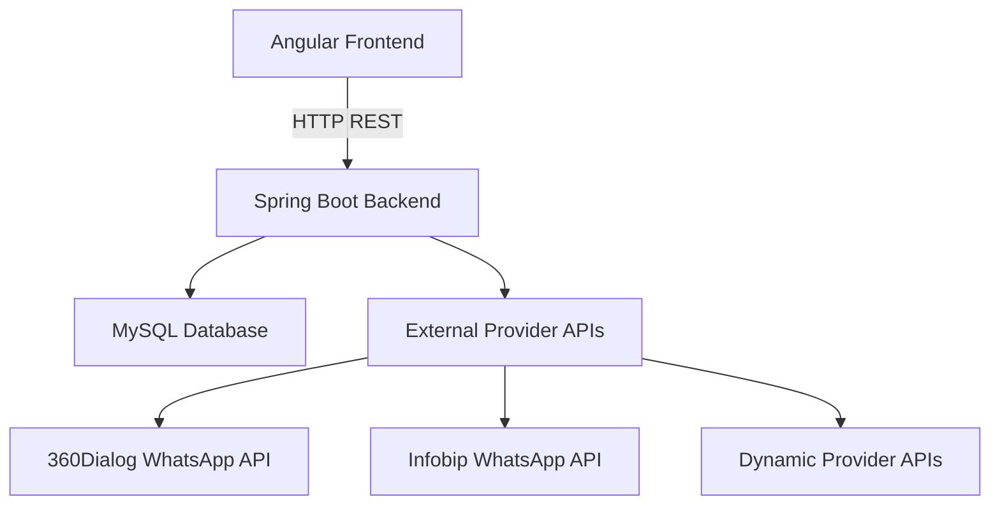
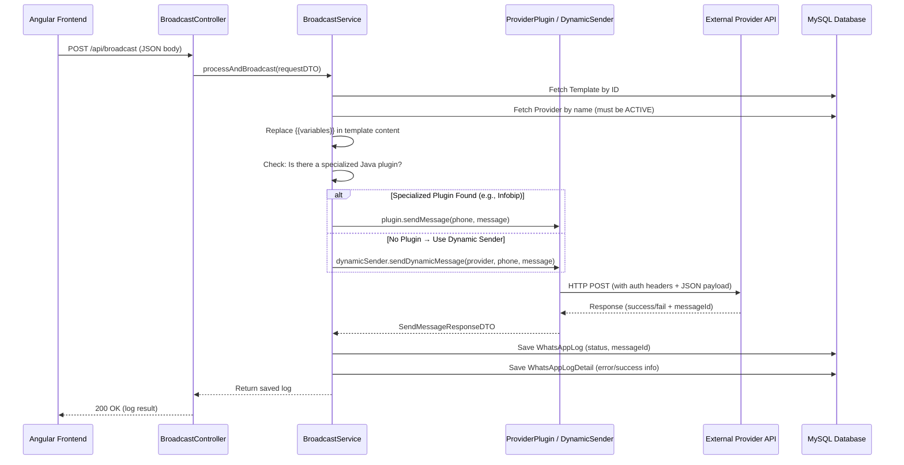
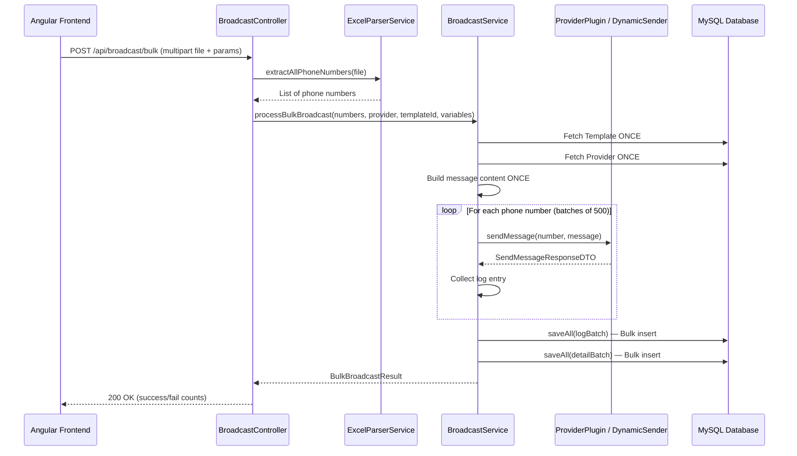
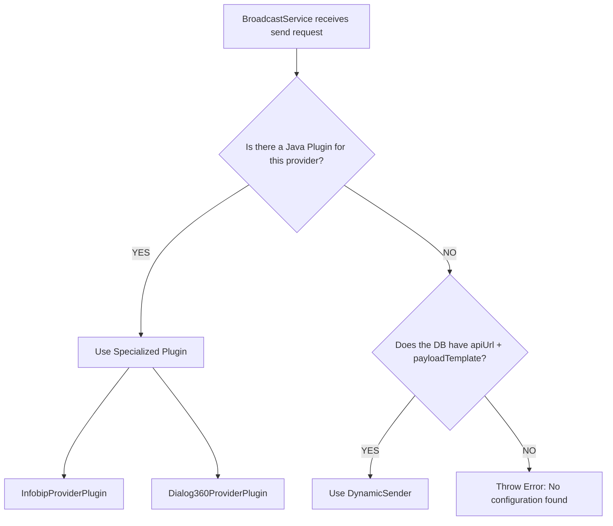
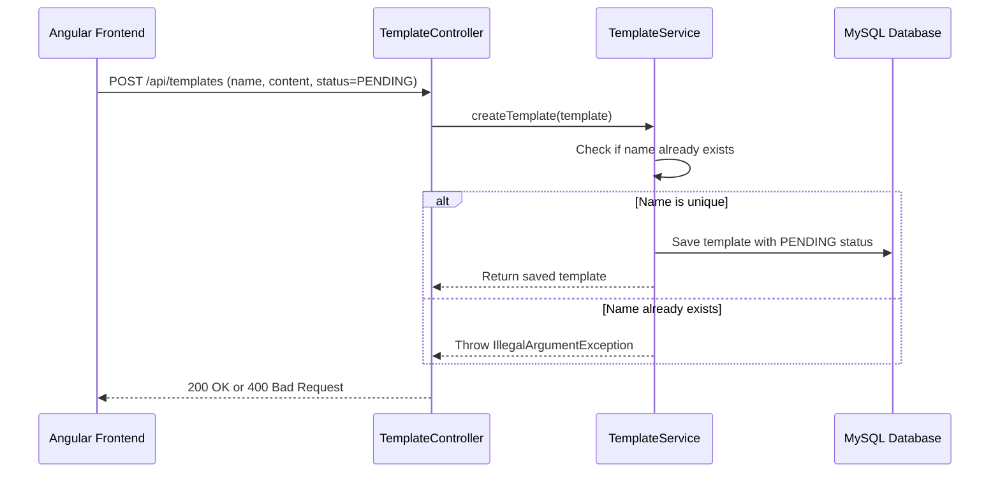
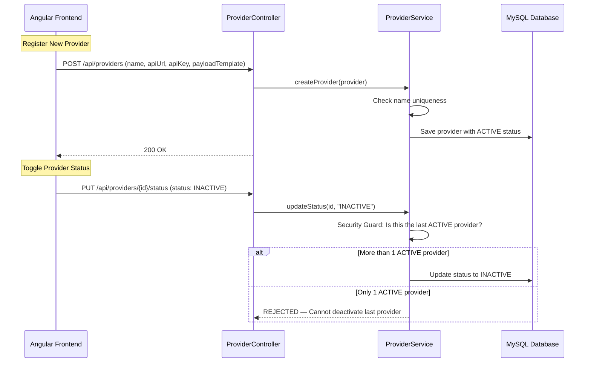
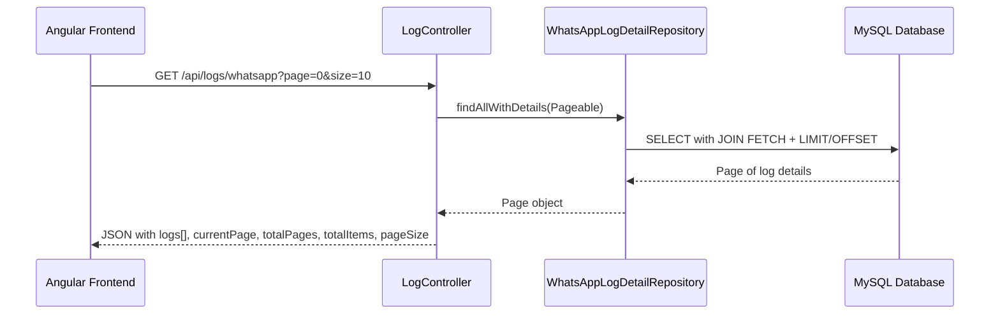
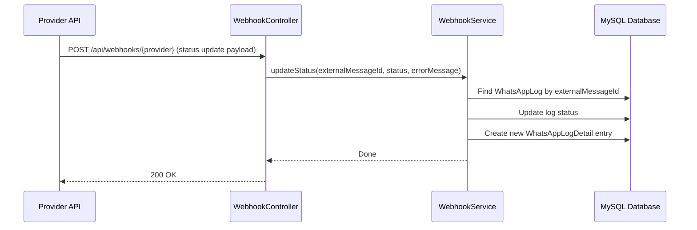

# 📡 WhatsApp Message Broadcast Portal — Complete Code Flow Documentation

> **Project Name**: Message Broadcast Portal  
> **Tech Stack**: Spring Boot 3.2.3 (Java 17) + Angular 19 + MySQL  
> **Last Updated**: March 20, 2026

---

## 📁 Project Architecture Overview



### Backend Structure
```
backend/src/main/java/com/example/messagebroadcast/
├── MessageBroadcastApplication.java   # Spring Boot entry point
├── config/
│   └── DatabaseSeeder.java            # Auto-seeds default providers & templates on first run
├── controller/
│   ├── BroadcastController.java       # Handles single & bulk message sends
│   ├── LogController.java             # Paginated message logs API
│   ├── ProviderController.java        # CRUD for providers (register, toggle status)
│   ├── TemplateController.java        # CRUD for message templates
│   └── WebhookController.java         # Receives delivery status updates from providers
├── dto/
│   ├── BroadcastRequestDTO.java       # Input for single message send
│   ├── BulkBroadcastResult.java       # Output for bulk blast results
│   └── SendMessageResponseDTO.java    # Standard response from any provider
├── entity/
│   ├── WhatsAppLog.java               # Message log record (who, what, when, status)
│   ├── WhatsAppLogDetail.java         # Detailed attempt info (error messages, timestamps)
│   ├── WhatsAppProvider.java          # Provider config (name, API URL, key, payload template)
│   └── WhatsAppTemp.java              # Message template (name, content, approval status)
├── enums/
│   ├── MessageStatus.java             # SENT, FAILED
│   ├── ProviderStatus.java            # ACTIVE, INACTIVE
│   └── ProviderType.java              # Provider type identifier
├── repository/
│   ├── WhatsAppLogDetailRepository.java
│   ├── WhatsAppLogRepository.java
│   ├── WhatsAppProviderRepository.java
│   └── WhatsAppTemplateRepository.java
└── service/
    ├── BroadcastProviderPlugin.java    # Interface for all provider plugins
    ├── BroadcastService.java          # Core orchestrator for sending messages
    ├── Dialog360ProviderPlugin.java   # Specialized 360Dialog connector
    ├── DynamicSender.java             # Universal connector for DB-registered providers
    ├── ExcelParserService.java        # Parses .xlsx/.csv files for bulk contacts
    ├── InfobipProviderPlugin.java     # Specialized Infobip connector
    ├── ProviderService.java           # Business logic for provider management
    ├── TemplateService.java           # Business logic for template management
    └── WebhookService.java            # Processes delivery status webhooks
```

### Frontend Structure
```
frontend/src/app/
├── app.ts                             # Root component
├── app.config.ts                      # Angular configuration
├── app.routes.ts                      # Route definitions
├── navbar/                            # Navigation bar component
├── excel-upload/                      # Excel/CSV bulk upload page
├── manual-number/                     # Single number message page
├── template-approvals/                # Template CRUD with placeholder support
├── provider-management/               # Provider CRUD with dynamic API config
└── message-logs/                      # Paginated message delivery logs
```

---

## 🗄️ Database Schema

### Table: `tbWhatsAppProvider`
| Column           | Type         | Description                                                   |
|------------------|--------------|---------------------------------------------------------------|
| `providerID`     | BIGINT (PK)  | Auto-generated unique ID                                      |
| `providerName`   | VARCHAR      | Unique name (e.g., `INFOBIP`, `360DIALOG`, `TWILIO`)         |
| `apiUrl`         | VARCHAR      | The provider's API endpoint URL                               |
| `apiKey`         | VARCHAR      | Authentication token/key for the provider                     |
| `payloadTemplate`| TEXT         | JSON blueprint with `{{phone}}` and `{{message}}` placeholders|
| `status`         | VARCHAR(20)  | `ACTIVE` or `INACTIVE`                                        |

### Table: `tbWhatsAppTemp`
| Column    | Type         | Description                                          |
|-----------|--------------|------------------------------------------------------|
| [id](file:///home/artem/Desktop/Backend/Message_Broadcast/frontend/src/app/provider-management/provider-management.ts#6-11)      | BIGINT (PK)  | Auto-generated unique ID                             |
| `name`    | VARCHAR      | Unique template name (e.g., `MedicalCamp`)           |
| `content` | TEXT         | Message body with `{{Name}}`, `{{Date}}` placeholders|
| `status`  | VARCHAR(20)  | `PENDING` or `APPROVED`                              |

### Table: `tbWhatsAppLog`
| Column               | Type         | Description                                  |
|----------------------|--------------|----------------------------------------------|
| `whatsAppLogID`      | BIGINT (PK)  | Auto-generated unique ID                     |
| `mobileNo`           | VARCHAR      | Recipient's phone number                     |
| `template_id`        | BIGINT (FK)  | Links to `tbWhatsAppTemp`                    |
| `provider_id`        | BIGINT (FK)  | Links to `tbWhatsAppProvider`                |
| `status`             | VARCHAR(20)  | `SENT` or `FAILED`                           |
| `external_message_id`| VARCHAR      | Message ID returned by the provider          |
| `created_at`         | DATETIME     | Auto-generated timestamp                     |

### Table: `tbWhatsAppLogDetails`
| Column          | Type         | Description                                   |
|----------------|--------------|-----------------------------------------------|
| `logDetailID`  | BIGINT (PK)  | Auto-generated unique ID                      |
| `whatsAppLogID`| BIGINT (FK)  | Links to `tbWhatsAppLog`                      |
| `status`       | VARCHAR(20)  | `SENT` or `FAILED`                            |
| `errorMessage` | TEXT         | Raw error or success response from provider   |
| `attemptAt`    | DATETIME     | Auto-generated timestamp of the attempt       |

---

## 🔌 Core Flow #1: Single Message Broadcast

This is triggered when a user sends a message to **one phone number** from the Manual Number page.



### Step-by-Step Code Walkthrough:

#### Step 1: Frontend sends the request
The Angular [ManualNumber](file:///home/artem/Desktop/Backend/Message_Broadcast/frontend/src/app/manual-number/manual-number.ts#5-113) component sends a `POST` request:
```typescript
this.http.post('http://localhost:8080/api/broadcast', {
  mobileNumber: '919876543210',
  provider: 'INFOBIP',
  templateId: 1,
  variables: { Name: 'Artem', Date: '25th March' }
}).subscribe(...);
```

#### Step 2: Controller receives it
[BroadcastController.java](file:///home/artem/Desktop/Backend/Message_Broadcast/backend/src/main/java/com/example/messagebroadcast/controller/BroadcastController.java) maps the JSON to [BroadcastRequestDTO](file:///home/artem/Desktop/Backend/Message_Broadcast/backend/src/main/java/com/example/messagebroadcast/dto/BroadcastRequestDTO.java#9-18):
```java
@PostMapping
public ResponseEntity<?> broadcastMessage(@RequestBody BroadcastRequestDTO requestDTO) {
    WhatsAppLog logResult = broadcastService.processAndBroadcast(requestDTO);
    return ResponseEntity.ok(logResult);
}
```

#### Step 3: Service orchestrates everything
[BroadcastService.java](file:///home/artem/Desktop/Backend/Message_Broadcast/backend/src/main/java/com/example/messagebroadcast/service/BroadcastService.java) performs:
1. **Fetches the template** from DB using `templateId`.
2. **Replaces variables** like `{{Name}}` → `Artem` using [buildMessageFromTemplate()](file:///home/artem/Desktop/Backend/Message_Broadcast/backend/src/main/java/com/example/messagebroadcast/service/BroadcastService.java#211-224).
3. **Resolves the provider**: First checks for a specialized Java plugin. If not found, falls back to [DynamicSender](file:///home/artem/Desktop/Backend/Message_Broadcast/backend/src/main/java/com/example/messagebroadcast/service/DynamicSender.java#14-70).
4. **Sends the message** via the resolved plugin/sender.
5. **Logs the result** in `tbWhatsAppLog` and `tbWhatsAppLogDetails`.

#### Step 4: Provider Plugin sends the HTTP request
- **InfobipProviderPlugin**: Uses Infobip-specific auth (`App <key>`) and JSON structure.
- **Dialog360ProviderPlugin**: Uses 360Dialog-specific auth (`D360-API-KEY`) and WhatsApp Business API payload.
- **DynamicSender**: Reads `apiUrl`, `apiKey`, and `payloadTemplate` from the database, replaces `{{phone}}` and `{{message}}`, and sends a generic POST.

---

## 📊 Core Flow #2: Bulk Broadcast (Excel Upload)

This is triggered when a user uploads an Excel/CSV file with multiple phone numbers.



### Key Optimizations:
1. **Template fetched ONCE** — Not N times for N contacts.
2. **Provider resolved ONCE** — Plugin or DynamicSender is determined once.
3. **Message content built ONCE** — Variable substitution happens once.
4. **DB writes batched** — Logs are saved in groups of 500 using `saveAll()` instead of individual [save()](file:///home/artem/Desktop/Backend/Message_Broadcast/frontend/src/app/template-approvals/template-approvals.ts#61-87) calls.
5. **10,000 contact limit** — Security guard prevents oversized uploads.

### ExcelParserService Logic:
[ExcelParserService.java](file:///home/artem/Desktop/Backend/Message_Broadcast/backend/src/main/java/com/example/messagebroadcast/service/ExcelParserService.java) supports:
- **`.xlsx` / `.xls`**: Parsed using Apache POI. Handles numeric cells (prevents scientific notation).
- **`.csv`**: Parsed line-by-line using `BufferedReader`.
- **Smart Detection**: Scans **every column** in each row to find the phone number (10-15 digits).
- **Deduplication**: Uses `LinkedHashSet` to remove duplicate numbers.

---

## 🔌 Core Flow #3: Specialized Plugin vs. Dynamic Sender

### The Hybrid Architecture



### Specialized Plugins (Hand-Tailored)
These are dedicated Java classes for complex providers:

| File | Provider | Why Specialized? |
|------|----------|------------------|
| [InfobipProviderPlugin.java](file:///home/artem/Desktop/Backend/Message_Broadcast/backend/src/main/java/com/example/messagebroadcast/service/InfobipProviderPlugin.java) | Infobip | Custom `App <key>` auth, complex JSON with `from` field, auto-appends `/whatsapp/1/message/text` to URL |
| [Dialog360ProviderPlugin.java](file:///home/artem/Desktop/Backend/Message_Broadcast/backend/src/main/java/com/example/messagebroadcast/service/Dialog360ProviderPlugin.java) | 360Dialog | Custom `D360-API-KEY` header, WhatsApp Business API payload with `messaging_product`, `recipient_type`, nested `text` object |

Both implement the [BroadcastProviderPlugin](file:///home/artem/Desktop/Backend/Message_Broadcast/backend/src/main/java/com/example/messagebroadcast/service/BroadcastProviderPlugin.java) interface:
```java
public interface BroadcastProviderPlugin {
    SendMessageResponseDTO sendMessage(String mobileNumber, String messageContent);
    String getProviderName();
}
```

### Dynamic Sender (Universal Connector)
[DynamicSender.java](file:///home/artem/Desktop/Backend/Message_Broadcast/backend/src/main/java/com/example/messagebroadcast/service/DynamicSender.java) handles **any provider** registered via the UI:
1. Reads `apiUrl`, `apiKey`, and `payloadTemplate` from the [WhatsAppProvider](file:///home/artem/Desktop/Backend/Message_Broadcast/backend/src/main/java/com/example/messagebroadcast/entity/WhatsAppProvider.java#10-40) entity.
2. Replaces `{{phone}}` and `{{message}}` in the stored JSON template.
3. Sets the `Authorization` header (auto-detects `Bearer` vs `Basic` vs raw key).
4. Sends a `POST` request using `RestTemplate`.

**Example**: If admin registers `MSG_91` with:
- API URL: `https://api.msg91.com/send`
- Payload: `{"mobile":"{{phone}}", "body":"{{message}}"}`

The DynamicSender will automatically construct and send:
```json
{"mobile":"919876543210", "body":"Hello Artem, welcome!"}
```

---

## 📋 Core Flow #4: Template Management



### Placeholder System:
Templates support dynamic variables wrapped in double braces:
- Template Content: `Hello {{Name}}, your appointment is on {{Date}} at {{Address}}.`
- During broadcast, [buildMessageFromTemplate()](file:///home/artem/Desktop/Backend/Message_Broadcast/backend/src/main/java/com/example/messagebroadcast/service/BroadcastService.java#211-224) replaces each `{{variable}}` with the actual value provided by the user.

### Frontend Features:
- **Modal Dialog**: Professional popup for creating templates.
- **Placeholder Toolbar**: Buttons to quickly insert `{{Name}}`, `{{Date}}`, `{{Address}}` into the content.
- **Delete Button**: Removes templates from the database with a confirmation dialog.

---

## 🔧 Core Flow #5: Provider Management



### Security Guard:
The system **always ensures at least one provider remains ACTIVE**. If an admin tries to deactivate the last active provider, the request is rejected with a clear error message.

---

## 📊 Core Flow #6: Message Logs (Paginated)



### Server-Side Pagination:
- The backend uses Spring Data's `Pageable` for efficient pagination.
- The repository uses `JOIN FETCH` to eagerly load related entities (template, provider) in a single query.
- A separate `countQuery` is used for total count (since `COUNT` + `JOIN FETCH` don't mix in JPQL).

### Frontend Pagination UI:
- **Stats Bar**: Shows "Showing 1-10 of 150 entries".
- **Page Size Selector**: Choose 10, 25, 50, or 100 entries per page.
- **Navigation Controls**: First, Previous, Page Numbers, Next, Last buttons.
- **Loading Overlay**: Spinner shown while fetching data.

---

## 🔄 Core Flow #7: Webhook Status Updates

When a provider sends a delivery status update (e.g., "message delivered"):



### Status Mapping:
[WebhookService.java](file:///home/artem/Desktop/Backend/Message_Broadcast/backend/src/main/java/com/example/messagebroadcast/service/WebhookService.java) maps provider-specific status strings to the simplified enum:
- `FAIL`, `REJECTED`, `ERROR` → `MessageStatus.FAILED`
- Everything else (including `DELIVERED`, `READ`) → `MessageStatus.SENT`

---

## 🌱 Database Seeder

[DatabaseSeeder.java](file:///home/artem/Desktop/Backend/Message_Broadcast/backend/src/main/java/com/example/messagebroadcast/config/DatabaseSeeder.java) runs automatically on first startup:
1. **Seeds Providers**: Creates `INFOBIP` and `360DIALOG` with `ACTIVE` status (only if the table is empty).
2. **Seeds Templates**: Creates a sample `MedicalCamp` template with `APPROVED` status.

---

## 🖥️ Frontend Routes

| Path          | Component            | Description                                    |
|---------------|----------------------|------------------------------------------------|
| `/upload`     | [ExcelUpload](file:///home/artem/Desktop/Backend/Message_Broadcast/frontend/src/app/excel-upload/excel-upload.ts#5-129)        | Upload Excel/CSV for bulk broadcasting         |
| `/manual`     | [ManualNumber](file:///home/artem/Desktop/Backend/Message_Broadcast/frontend/src/app/manual-number/manual-number.ts#5-113)       | Send message to a single phone number          |
| `/templates`  | [TemplateApprovals](file:///home/artem/Desktop/Backend/Message_Broadcast/frontend/src/app/template-approvals/template-approvals.ts#6-105)  | Create, view, and delete message templates     |
| `/providers`  | [ProviderManagement](file:///home/artem/Desktop/Backend/Message_Broadcast/frontend/src/app/provider-management/provider-management.ts#12-106) | Register, toggle, and manage API providers     |
| `/logs`       | [MessageLogs](file:///home/artem/Desktop/Backend/Message_Broadcast/frontend/src/app/message-logs/message-logs.ts#6-96)        | View paginated message delivery logs           |
| `/` (default) | Redirects to `/upload`|                                               |

---

## 🔐 Key Design Decisions

### 1. Hybrid Provider Architecture
- **Specialized Plugins** for complex, high-traffic providers (Infobip, 360Dialog).
- **Dynamic Sender** for instant, zero-code provider expansion via UI.
- **Benefit**: Stability for core APIs + flexibility for new integrations.

### 2. Simplified Message Status
- Only two statuses: `SENT` and `FAILED`.
- Provider accepted + returned external ID = `SENT`.
- Provider rejected = `FAILED`.
- Webhook updates are tracked in [WhatsAppLogDetail](file:///home/artem/Desktop/Backend/Message_Broadcast/backend/src/main/java/com/example/messagebroadcast/entity/WhatsAppLogDetail.java#13-41) for audit purposes.

### 3. Batch Processing
- Bulk broadcasts use `saveAll()` with batch sizes of 500.
- Template, provider, and message content are resolved ONCE before the loop.
- Maximum of 10,000 contacts per upload (security limit).

### 4. Security Guards
- At least one provider must remain `ACTIVE` at all times.
- Template names must be unique.
- Provider names must be unique.
- Excel uploads capped at 10,000 contacts.

---

## ⚙️ Configuration

### [application.properties](file:///home/artem/Desktop/Backend/Message_Broadcast/backend/src/main/resources/application.properties)
```properties
# Database
spring.datasource.url=jdbc:mysql://localhost:3306/message_broadcast_db
spring.jpa.hibernate.ddl-auto=update

# Infobip
app.provider.infobip.api-key=<YOUR_KEY>
app.provider.infobip.base-url=https://<YOUR_DOMAIN>.api.infobip.com

# 360Dialog
app.provider.360dialog.api-key=<YOUR_KEY>
app.provider.360dialog.base-url=https://waba.360dialog.io/v1/messages
```

### Dependencies ([pom.xml](file:///home/artem/Desktop/Backend/Message_Broadcast/backend/pom.xml))
- `spring-boot-starter-web` — REST APIs + RestTemplate
- `spring-boot-starter-data-jpa` — Hibernate + JPA
- `mysql-connector-j` — MySQL driver
- `lombok` — Boilerplate reduction (@Data, @Builder, @Slf4j)
- `poi-ooxml` — Apache POI for Excel parsing

---

## 🚀 How to Run

### Backend
```bash
cd backend
mvn spring-boot:run
# Starts on http://localhost:8080
```

### Frontend
```bash
cd frontend
ng serve
# Starts on http://localhost:4200
```

---

> **Summary**: This portal is a professional-grade WhatsApp broadcast system that combines the reliability of specialized API connectors with the flexibility of a dynamic, database-driven provider engine. It supports single and bulk messaging, template management with placeholders, provider lifecycle management, and comprehensive delivery logging with pagination.
